# Big Data — Week 3 Lab

**Student:** Mutangana Joseph<br>
**Student ID** 29061<br>
**Course:** Introduction to Big Data Analytics<br>
**Lab:** Week 3 — Control Flow & Functions<br>

## Introduction

This README shows how I completed the Week 3 lab exercises.

The lab helped me practice Python control flow, loops, functions, file handling, error handling, and working with a CSV dataset.

For each exercise, I included a short explanation and a screenshot of the output.

All screenshots are stored in the `screenshots` folder.

---

# Part 1 — Control Flow

## Exercise 1.1 — Grading System

In this exercise, I created a grading system using `if`, `elif`, and `else`.

The program checks the score and gives a grade:

* A: 85 and above
* B: 70–84
* C: 60–69
* D: 50–59
* F: below 50

### Output 

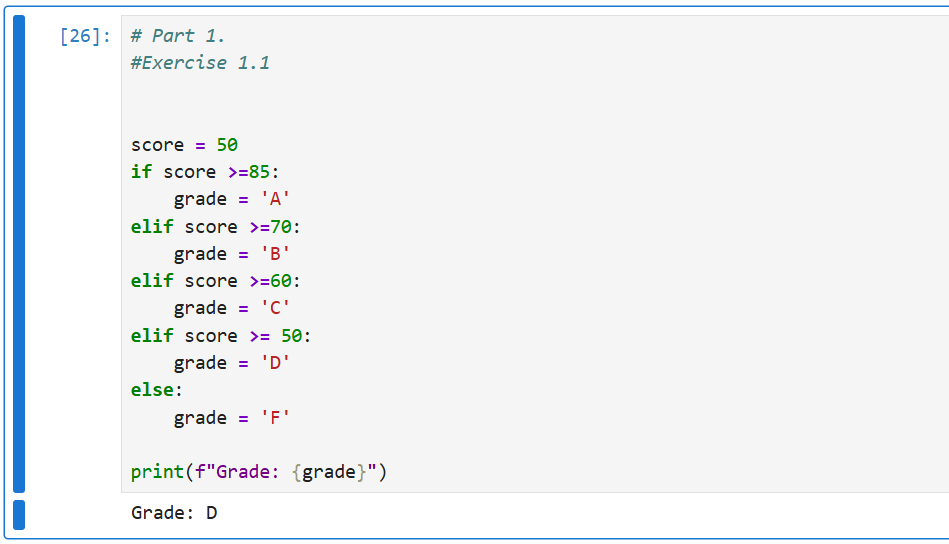

---

## Exercise 1.2 — Course Validation

Here I checked both the student's score and attendance.

A student is validated when the score is at least 50 and attendance is at least 75%.

The program also shows whether the student has low attendance or has failed.

### Output

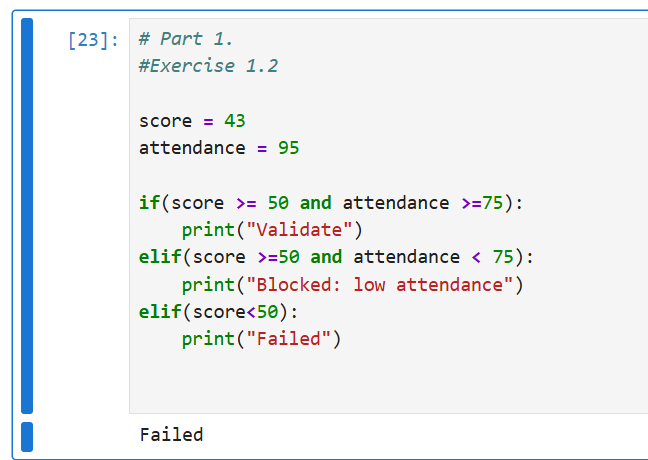

---

## Exercise 1.3 — Order of Conditions

This exercise helped me understand why the order of `if` and `elif` conditions matters.

If a lower condition such as `score >= 50` is checked before `score >= 70`, some higher scores can be caught by the wrong condition.

### Output

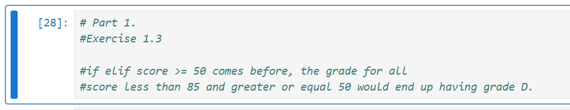

---

# Part 2 — Loops

## Exercise 2.1 — Top Scores

I used a `for` loop to go through the scores and print only scores that are 80 or above.

### Output

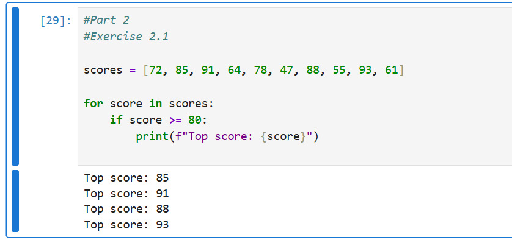

---

## Exercise 2.2 — Score Statistics

I used one loop to calculate:

* Total score
* Number of scores
* Average score
* Number of passed students
* Number of failed students

I did not use `sum()`, `len()`, or `max()` for the calculations.

### Output

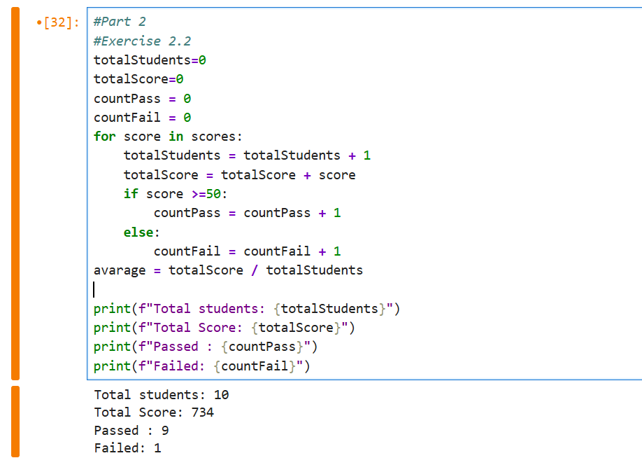

---

## Exercise 2.3 — Saving for a Laptop

I used a `while` loop to calculate how many months it would take to save 250,000 RWF when saving 15,000 RWF every month.

### Output

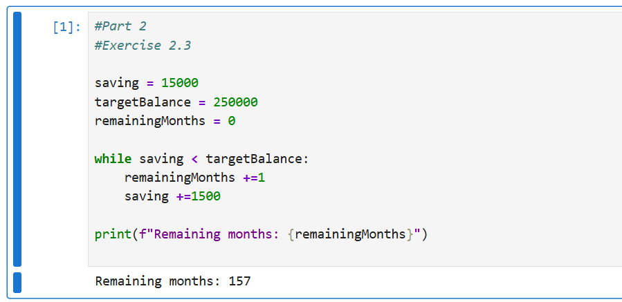

---

# Part 3 — Functions

## Exercise 3.1 — Grade Function

I created a `get_grade()` function that receives a score and returns the correct grade.

I tested the function with different scores.

### Output

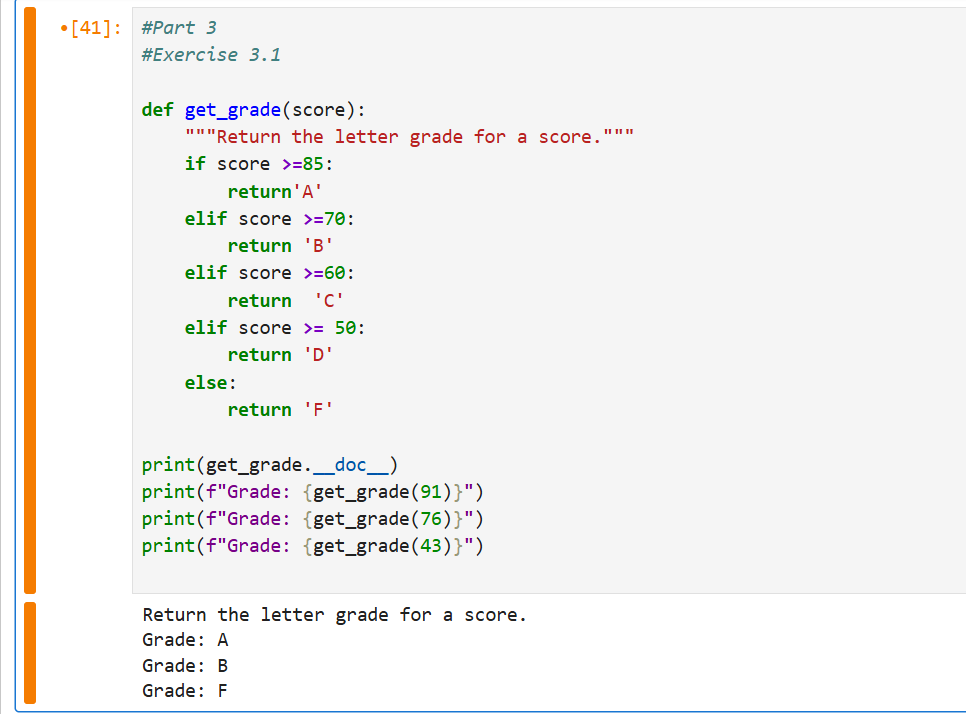

---

## Exercise 3.2 — Pass Rate Function

I created a `pass_rate()` function that calculates the percentage of students who passed.

A passing score is 50 or above.

### Output

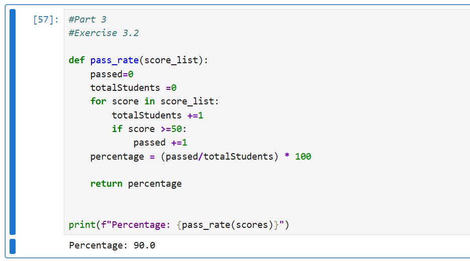

---

# Part 4 — Reading the CSV File

## Exercise 4.1 — Reading the File

I opened the `week3_students.csv` file using `with open()` and `readlines()`.

I displayed:

* The number of lines
* The header
* The first student record

There are 41 lines because the file contains 40 student records plus one header line.

### Output

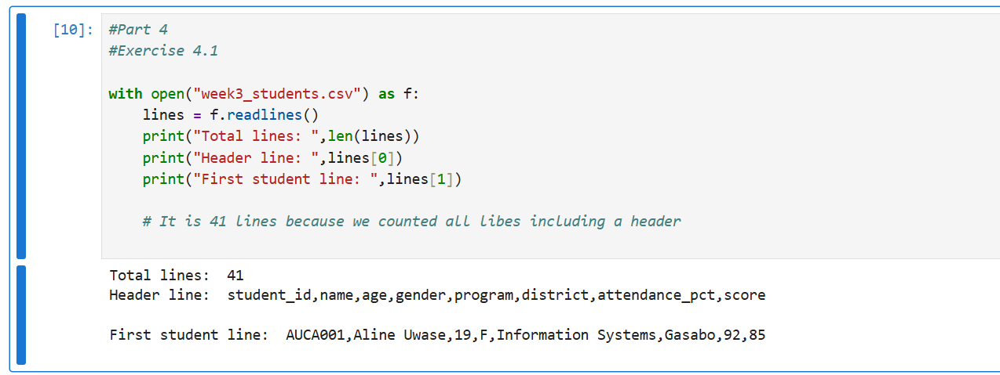

---

## Exercise 4.2 — Getting Student Names

I skipped the header using `lines[1:]`.

Then I split each line using the comma and collected the student names.

There are 40 student names in the dataset.

### Output

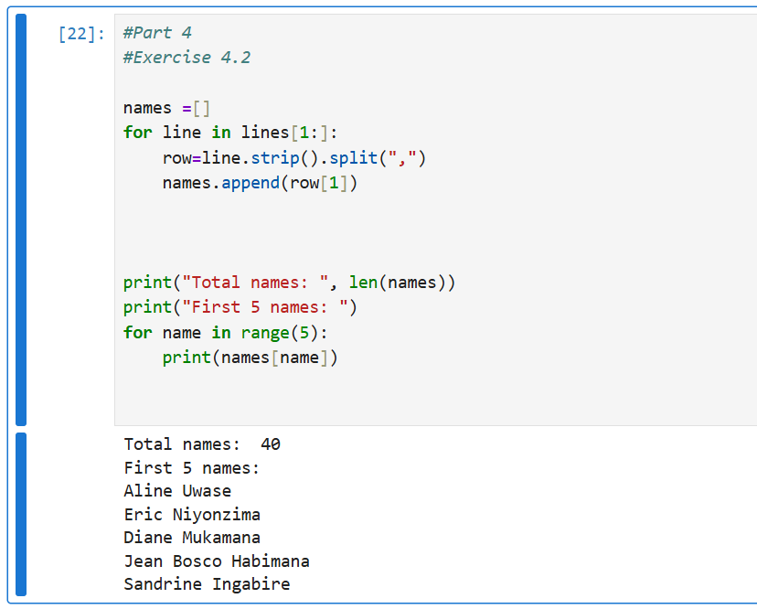

---

# Part 5 — Working with the Student Dataset

## Exercise 5.1 — Handling Broken Scores

In this exercise, I processed all the student records and converted the score to an integer.

Some records had broken scores, so I used `try` and `except` to prevent the program from stopping.

The program found 3 broken records and continued processing the valid records.

It also calculated the average using only the valid scores.

### Output

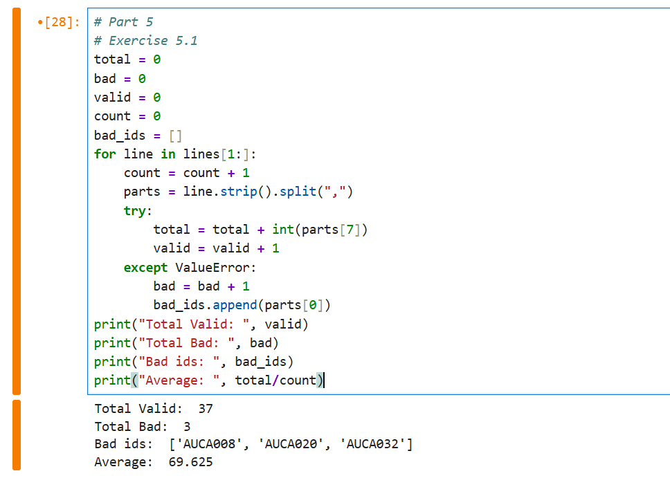

---

## Exercise 5.2 — Passed, Failed and Top Student

I used the valid scores to count the students who passed and failed.

I also used a loop to find the student with the highest score and then used the `get_grade()` function to find the student's grade.

### Output

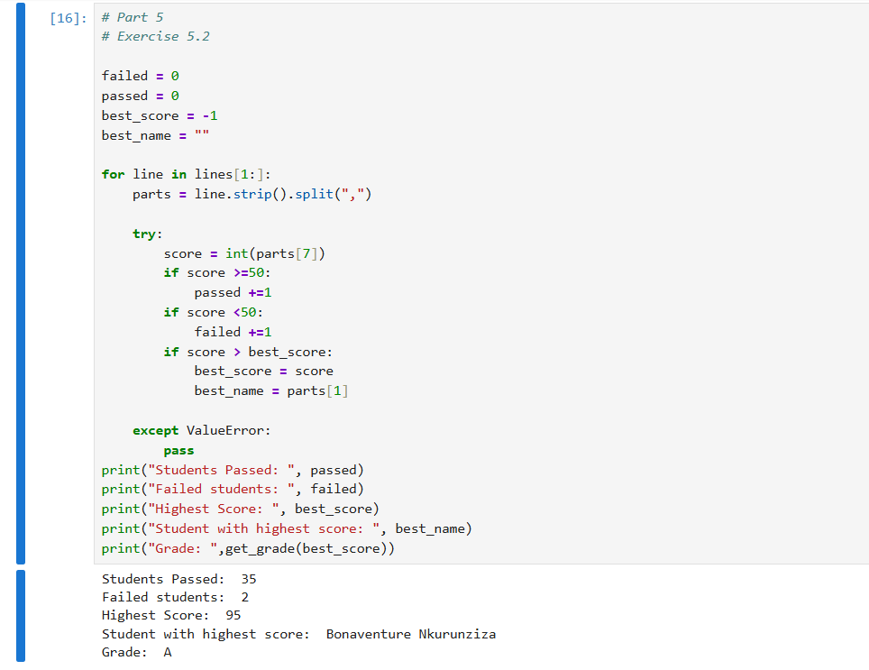

---

## Exercise 5.3 — District Averages

This exercise was about finding the average score for each district.

I did not write the district names manually. Instead, the program reads the district from the CSV file.

I used two dictionaries:

* `sums` to store the total scores for each district
* `counts` to store the number of students in each district

The average is then calculated using:

```text
district total score / number of students
```

After calculating all district averages, I compared them to find the district with the highest average.

### Output

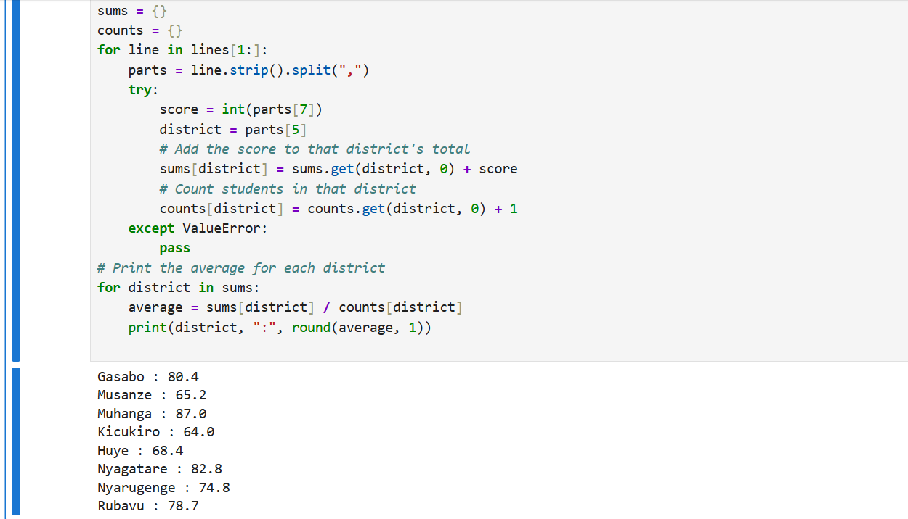
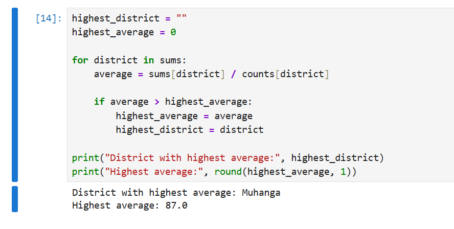

---

# Bonus — Create a Report File

For the bonus exercise, I created a `week3_report.txt` file using Python.

The report contains information such as:

* Number of students
* Valid scores
* Broken scores
* Average score
* Top student

## Writing the Report

The program writes the results into the text file.

### Output

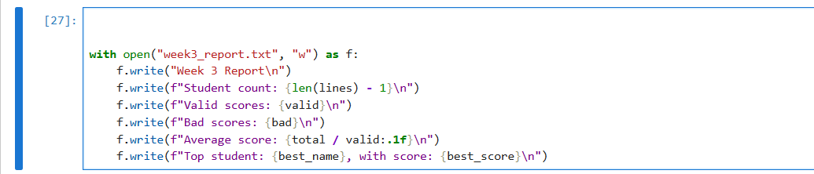

---

## Reading the Report

After creating the file, I opened it again and read its contents using Python.

### Output

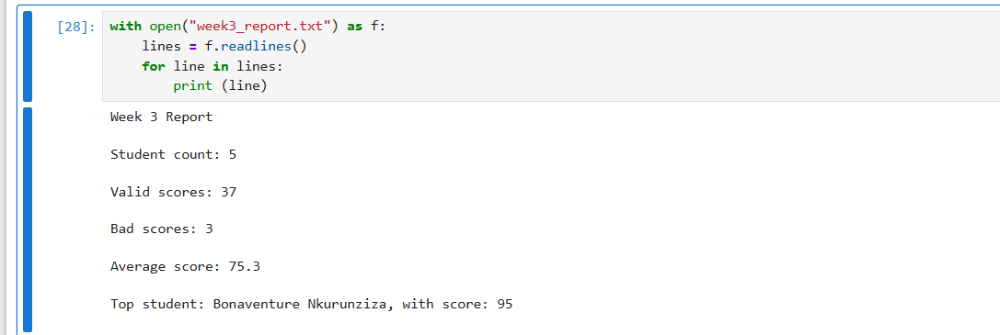

---

# Reflection

## 1. Broken Records

The dataset contains 3 broken score records out of 40 students.

Instead of allowing the program to stop when it finds a broken score, I used `try` and `except` to handle the error.

The broken records are skipped while the valid records continue to be processed.

## 2. What I Learned

One thing that was interesting to me was how Python can work with a real dataset instead of only working with values that are manually written in the program.

I also learned how dictionaries can be used to collect information automatically, such as adding scores and counting students for each district.

---

# Files in This Submission

The main files used for this lab are:

* `Week3_MutanganaJoseph.ipynb` — completed Python notebook
* `README.md` — this report
* `screenshots/` — screenshots showing the outputs
* `week3_students.csv` — provided dataset
* `week3_report.txt` — bonus report file

# Conclusion

This lab helped me practice Python control flow, loops, functions, file handling, error handling, and basic data analysis.

I also learned how to handle incorrect data without stopping the whole program and how to calculate information from different groups in a dataset.
